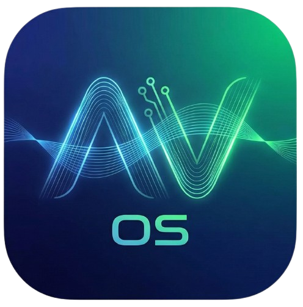

AV OS Launcher

 
<h3>The Fusion of Glassmorphism & Ergonomics</h3>

<b>Developer:</b> Mohammed Atif 
<a href="https://www.google.com/search?q=http://mohammedatif.free.nf">mohammedatif.free.nf</a>

📱 About The Project

AV OS is a next-generation Android Launcher built to bridge the gap between web technologies and native performance. It features a unique "Fusion UI" design language that combines the best elements of modern mobile interfaces:

HyperOS Aesthetics: Heavy use of glassmorphism, blur effects, and fluid animations.

One UI Ergonomics: Interactive elements placed within reach (bottom-focused search and navigation).

Unlike standard web-based launchers, AV OS uses a custom-built Native Java Bridge to cache app icons directly from the Android system to the local file system, ensuring zero lag and instant loading times.

🚀 Features

⚡ Zero-Lag Icon Caching: Custom Capacitor plugin converts and caches Android Drawables to local PNGs, bypassing slow Base64 rendering.

🎨 Fusion Design: A visually stunning interface with live blur, dynamic scaling, and smooth transitions.

📂 Smart App Drawer: Swipe-up drawer with categorized grid layout and fast search.

🏠 Home Screen Widget: Elegant time/date display with "Set Default Launcher" integration.

🔎 Fast Search: Instantly filter through hundreds of apps.

🔧 Native Integration: Fully functional as a default Android home app (category.HOME).

🛠️ Tech Stack

Frontend: React (TypeScript), Vite

Styling: Tailwind CSS (Glassmorphism & Animations)

Mobile Engine: CapacitorJS (Android)

Native Bridge: Custom Java Plugin (InstalledAppsPlugin.java) for PackageManager and Intent handling.

📸 Screenshots

Home Screen

App Drawer

Search

(Add Screenshot Here)

(Add Screenshot Here)

(Add Screenshot Here)

⚙️ Installation & Build

To build this project locally, you will need Node.js and Android Studio installed.

Clone the repository:

git clone [https://github.com/YOUR_USERNAME/av-os-launcher.git](https://github.com/YOUR_USERNAME/av-os-launcher.git)
cd av-os-launcher

Install dependencies:

npm install

Build the React frontend:

npm run build

Sync with Android:

npx cap sync

Run on Device:

npx cap open android

Click the Green Play Button in Android Studio to launch on your connected device.

🧩 Native Plugin Details

This project includes a custom Capacitor plugin located at android/app/src/main/java/com/av/os/InstalledAppsPlugin.java.

Capabilities:

getApps(): Fetches installed apps and caches icons to context.getCacheDir().

launchApp(packageName): Launches apps via Native Intents.

requestDefaultLauncher(): Opens Android Home Settings.

🤝 Contact

Mohammed Atif 🌐 Website: mohammedatif.free.nf

Built with ❤️ by Mohammed Atif.
